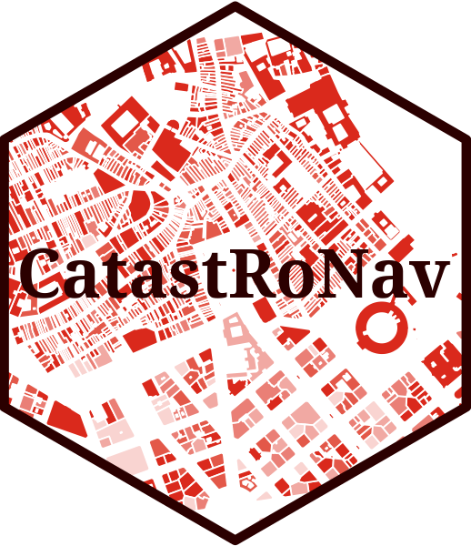

<!-- README.md is generated from README.Rmd. Please edit that file -->

```{r, include = FALSE}
knitr::opts_chunk$set(
  collapse = TRUE,
  message = FALSE,
  warning = FALSE,
  dev = "ragg_png",
  tidy = "styler",
  comment = "#>",
  fig.path = "man/figures/README-",
  out.width = "100%"
)
library(CatastRoNav)
```

# CatastRoNav 

<!-- badges: start -->

[](https://ropenspain.es/)
[](https://ropenspain.r-universe.dev)
[](https://github.com/rOpenSpain/CatastRoNav/actions?query=workflow%3AR-CMD-check)
[](https://app.codecov.io/gh/rOpenSpain/CatastroNav)
[](https://doi.org/10.5281/zenodo.6366407)
[](https://www.repostatus.org/#active)

<!-- badges: end -->

**CatastRoNav** is a package that provide access to different API services of
the [Cadastre of Navarre](https://geoportal.navarra.es/es/idena). With
**CatastRoNav** it is possible to download spatial objects as buildings or
cadastral parcels.

## Installation

You can install the developing version of **CatastRoNav** using the
[r-universe](https://ropenspain.r-universe.dev/CatastRoNav):

```{r, eval = FALSE}
# Enable this universe
options(repos = c(
  ropenspain = "https://ropenspain.r-universe.dev",
  CRAN = "https://cloud.r-project.org"
))
install.packages("CatastRoNav")
```

Alternatively, you can install the developing version of **CatastRoNav** with:

```{r, eval = FALSE}
library(remotes)
install_github("rOpenSpain/CatastRoNav", dependencies = TRUE)
```

## Usage

The WFS service allows to download vector objects of specific cadastral
elements. The result is provided as `sf` objects (See **sf** package).

```{r wfs}
library(CatastRoNav)
library(ggplot2)

wfs_get_buildings <- catrnav_wfs_get_buildings_bbox(
  c(-1.652563, 42.478016, -1.646919, 42.483333),
  srs = 4326
)
# Map
ggplot(wfs_get_buildings) +
  geom_sf() +
  ggtitle("Olite, Navarra")
```

## Citation

```{r echo=FALSE, results='asis'}
print(citation("CatastRoNav"), bibtex = FALSE)
```

A BibTeX entry for LaTeX users is:

```{r echo=FALSE, comment=''}
toBibtex(citation("CatastRoNav"))
```

## See also

The package [CatastRo](https://CRAN.R-project.org/package=CatastRo) provides
similar functionalities for Spain excluding the Basque Country and Navarre.

## Terms and conditions of use

Data provided by the Government of Navarre under [Creative Commons Attribution
(CC BY 4.0)](https://creativecommons.org/licenses/by/4.0/deed.en_EN). The
service is provided "as is", and without guarantee of any kind, implicit or
explicit.

Data source: [SITNA -- Government of
Navarre](https://sitna.navarra.es/geoportal/)
