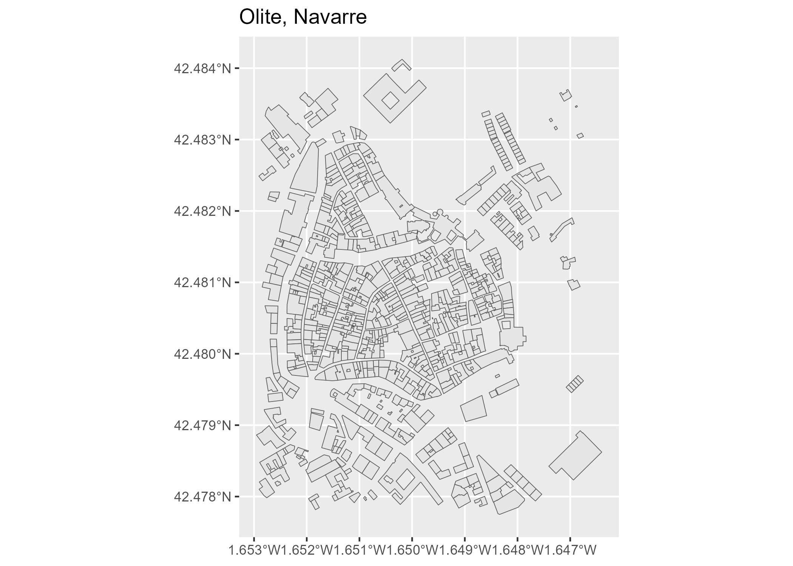

<!-- README.md is generated from README.qmd. Please edit that file -->

# CatastRoNav <a href="https://ropenspain.github.io/CatastRoNav/"></a>

<!-- badges: start -->

[](https://ropenspain.es/)
[](https://ropenspain.r-universe.dev/CatastRoNav)
[](https://github.com/rOpenSpain/CatastRoNav/actions/workflows/roscron-check-standard.yaml)
[](https://app.codecov.io/gh/rOpenSpain/CatastroNav)
[](https://doi.org/10.5281/zenodo.6366407)
[](https://www.repostatus.org/#active)

<!-- badges: end -->

**CatastRoNav** provides access to services from the [Cadastre of
Navarre](https://geoportal.navarra.es/es/idena). With **CatastRoNav**,
you can retrieve addresses, buildings and cadastral parcels through its
INSPIRE ATOM, WFS and WMS services.

## Installation

You can install the development version of **CatastRoNav** from
[r-universe](https://ropenspain.r-universe.dev/CatastRoNav):

``` r
# Install CatastRoNav in R.
install.packages(
  "CatastRoNav",
  repos = c(
    "https://ropenspain.r-universe.dev",
    "https://cloud.r-project.org"
  )
)
```

Alternatively, you can install the development version of
**CatastRoNav** with:

``` r
pak::pak("rOpenSpain/CatastRoNav")
```

## Package API

The functions of **CatastRoNav** are organized by source service. The
package naming convention is `catrnav_*service*_*description*`.

### INSPIRE services

INSPIRE functions retrieve spatial objects from the Cadastre of Navarre
using the **sf** package. There are two INSPIRE services:

#### ATOM service

The ATOM service downloads complete municipal datasets for different
cadastral elements. Results are returned as `sf` objects from the **sf**
package.

These functions use the `catrnav_atom_get_*()` prefix.

#### WFS service

The WFS service downloads vector objects for specific cadastral elements
within a selected bounding box. Results are returned as `sf` objects
from the [**sf**](https://r-spatial.github.io/sf/) package. For full
municipal downloads, prefer the ATOM service.

These functions use the `catrnav_wfs_get_*()` prefix.

#### Terms and conditions of use

Data are provided by the Government of Navarre under the [Creative
Commons Attribution 4.0 International (CC BY
4.0)](https://creativecommons.org/licenses/by/4.0/) license. The service
is provided “as is” without warranties of any kind, either express or
implied.

Data source: [SITNA – Government of
Navarre](https://geoportal.navarra.es/es/inspire).

## Examples

### Extract geometries using the WFS service

``` r
library(CatastRoNav)
library(ggplot2)

wfs_get_buildings <- catrnav_wfs_get_buildings_bbox(
  c(-1.652563, 42.478016, -1.646919, 42.483333),
  srs = 4326
)
# Map.
ggplot(wfs_get_buildings) +
  geom_sf() +
  ggtitle("Olite, Navarra")
```



## Cache management

Downloaded files are cached locally. Use `catrnav_detect_cache_dir()` to
inspect the active cache, `catrnav_set_cache_dir()` to configure it and
`catrnav_clear_cache()` to remove cached data.

## Citation

<p>

Hernangómez D (2026). <em>CatastRoNav: Interface to the API Catastro de
Navarra</em>.
<a href="https://doi.org/10.5281/zenodo.6366407">doi:10.5281/zenodo.6366407</a>.
<a href="https://ropenspain.github.io/CatastRoNav/">https://ropenspain.github.io/CatastRoNav/</a>.
</p>

A BibTeX entry for LaTeX users is:

    @Manual{R-catastronav,
      title = {{CatastRoNav}: Interface to the {API} {Catastro} de {Navarra}},
      author = {Diego Hernangómez},
      year = {2026},
      version = {0.1.0.9000},
      doi = {10.5281/zenodo.6366407},
      url = {https://ropenspain.github.io/CatastRoNav/},
      abstract = {Access public spatial data from the Cadastre of Navarre through its INSPIRE services. Retrieve cadastral parcel, building and address data for Navarre (Spain).},
    }

## Contributing

See the [source code and issue
tracker](https://github.com/rOpenSpain/CatastRoNav) on GitHub.

## See also

The [**CatastRo**](https://CRAN.R-project.org/package=CatastRo) package
provides similar functionality for the rest of Spain, excluding the
Basque Country and Navarre.
