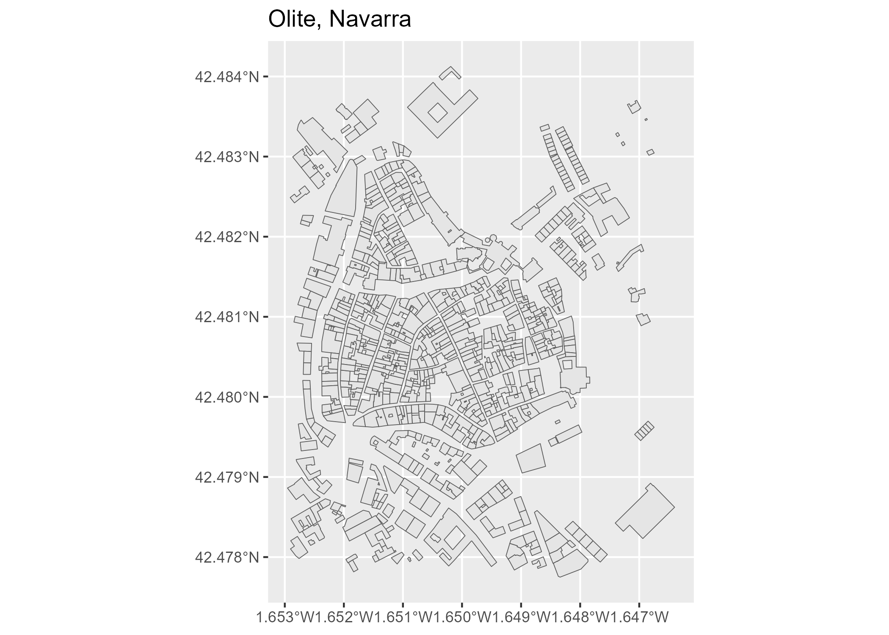

<!-- README.md is generated from README.Rmd. Please edit that file -->

# CatastRoNav 

<!-- badges: start -->

[](https://ropenspain.es/)
[](https://ropenspain.r-universe.dev/CatastRoNav)
[](https://github.com/rOpenSpain/CatastRoNav/actions/workflows/roscron-check-standard.yaml)
[](https://app.codecov.io/gh/rOpenSpain/CatastroNav)
[](https://doi.org/10.5281/zenodo.6366407)
[](https://www.repostatus.org/#active)

<!-- badges: end -->

**CatastRoNav** is a package that provide access to different API
services of the [Cadastre of
Navarre](https://geoportal.navarra.es/es/idena). With **CatastRoNav** it
is possible to download spatial objects as buildings or cadastral
parcels.

## Installation

You can install the developing version of **CatastRoNav** using the
[r-universe](https://ropenspain.r-universe.dev/CatastRoNav):

``` r
# Install CatastRoNav in R:
install.packages("CatastRoNav",
  repos = c(
    "https://ropenspain.r-universe.dev",
    "https://cloud.r-project.org"
  )
)
```

Alternatively, you can install the developing version of **CatastRoNav**
with:

``` r
remotes::install_github("rOpenSpain/CatastRoNav", dependencies = TRUE)
```

## Usage

The WFS service allows to download vector objects of specific cadastral
elements. The result is provided as `sf` objects (See [**sf**
package](https://r-spatial.github.io/sf/)).

``` r
library(CatastRoNav)
library(ggplot2)

wfs_get_buildings <- catrnav_wfs_get_buildings_bbox(
  c(-1.652563, 42.478016, -1.646919, 42.483333),
  srs = 4326
)
# Map
ggplot(wfs_get_buildings) +
  geom_sf() +
  ggtitle("Olite, Navarra")
```



## Citation

<p>
Hernangómez D (2025). <em>CatastRoNav: Interface to the API Catastro de
Navarra</em>.
<a href="https://doi.org/10.5281/zenodo.6366407">doi:10.5281/zenodo.6366407</a>,
<a href="https://ropenspain.github.io/CatastRoNav/">https://ropenspain.github.io/CatastRoNav/</a>.
</p>

A BibTeX entry for LaTeX users is:

    @Manual{R-catastronav,
      title = {{CatastRoNav}: Interface to the {API} {Catastro} de {Navarra}},
      author = {Diego Hernangómez},
      year = {2025},
      version = {0.1.0},
      doi = {10.5281/zenodo.6366407},
      url = {https://ropenspain.github.io/CatastRoNav/},
      abstract = {Access public spatial data available under the INSPIRE directive. Tools for downloading references, buildings and addresses of properties on Navarre (Spain).},
    }

## See also

The package [CatastRo](https://CRAN.R-project.org/package=CatastRo)
provides similar functionalities for Spain excluding the Basque Country
and Navarre.

## Terms and conditions of use

Data provided by the Government of Navarre under [Creative Commons
Attribution (CC BY 4.0)](https://creativecommons.org/licenses/by/4.0/).
The service is provided “as is”, and without guarantee of any kind,
implicit or explicit.

Data source: [SITNA – Government of
Navarre](https://geoportal.navarra.es/es/inspire)

## Contributors

<!-- ALL-CONTRIBUTORS-LIST:START - Do not remove or modify this section -->
<!-- prettier-ignore-start -->
<!-- markdownlint-disable -->

All contributions to this project are gratefully acknowledged using the
[`allcontributors` package](https://github.com/ropensci/allcontributors)
following the [allcontributors](https://allcontributors.org)
specification. Contributions of any kind are welcome!

<table class="table allctb-table">
<tr>
<td align="center">
<a href="https://github.com/dieghernan">

</a><br>
<a href="https://github.com/rOpenSpain/CatastRoNav/commits?author=dieghernan">dieghernan</a>
</td>
<td align="center">
<a href="https://github.com/fgoerlich">

</a><br>
<a href="https://github.com/rOpenSpain/CatastRoNav/commits?author=fgoerlich">fgoerlich</a>
</td>
</tr>
</table>
<!-- markdownlint-enable -->
<!-- prettier-ignore-end -->
<!-- ALL-CONTRIBUTORS-LIST:END -->
