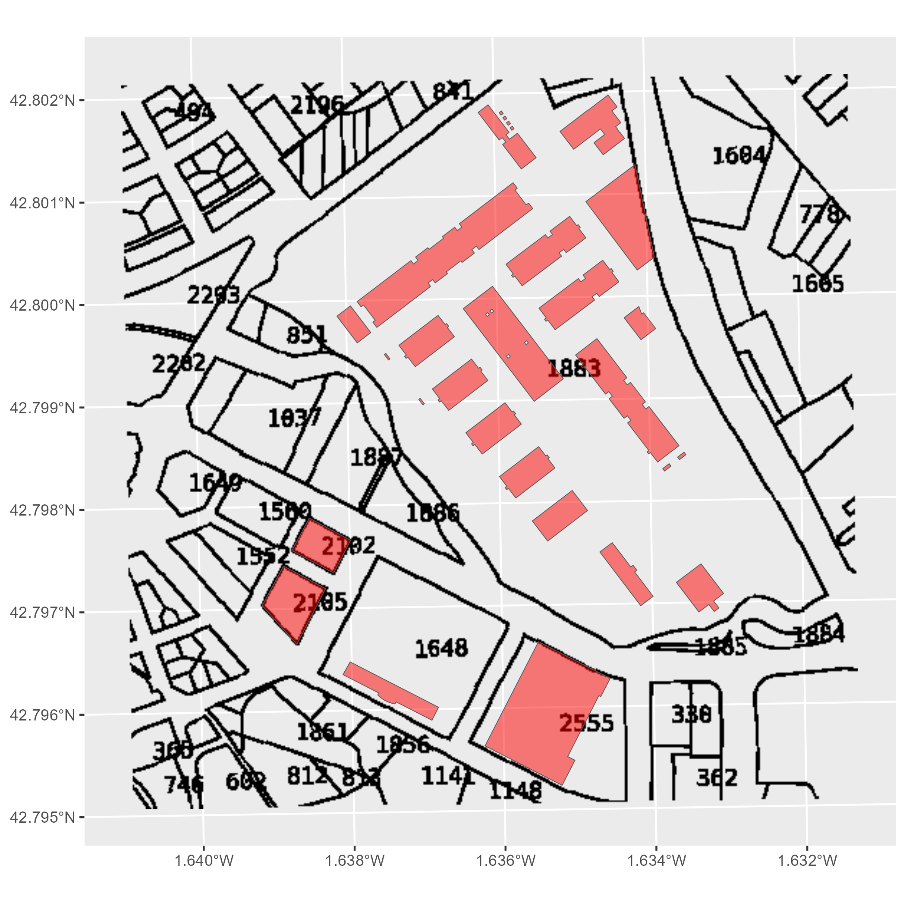
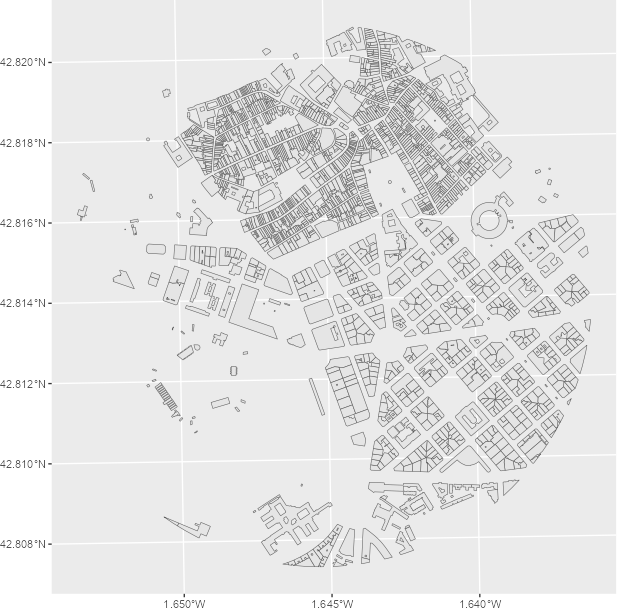
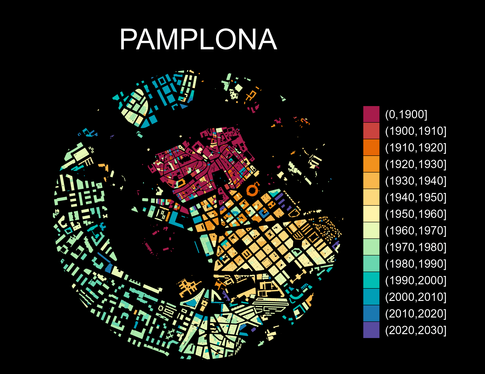

# Get started

**CatastRoNav** provides access to services from the [Cadastre of
Navarre](https://geoportal.navarra.es/es/idena). With **CatastRoNav**,
you can retrieve addresses, buildings and cadastral parcels through its
INSPIRE ATOM and WFS services, and download georeferenced images through
its WMS service.

## INSPIRE services

> The INSPIRE Directive aims to create a European Union Spatial Data
> Infrastructure (SDI) for EU environmental policies and policies or
> activities that may affect the environment. This infrastructure
> enables public sector organizations to share environmental spatial
> information, facilitates public access to spatial information across
> Europe and assists in policy-making across boundaries.
>
> *Source: [INSPIRE Knowledge
> Base](https://knowledge-base.inspire.ec.europa.eu/overview_en).*

The Cadastre of Navarre implements the INSPIRE directive through three
services:

1.  **ATOM service:** Downloads complete municipal cadastral datasets.
2.  **WFS service:** Retrieves cadastral features within a supplied
    bounding box.
3.  **WMS service:** Downloads georeferenced map images for different
    cadastral elements.

ATOM download and WFS query functions return addresses, buildings and
cadastral parcels as `sf` objects from the **sf** package. ATOM index
and search functions return tibbles. WMS returns georeferenced images as
`SpatRaster` objects from the **terra** package.

## Examples

### Working with layers

This example demonstrates the main capabilities of **CatastRoNav** by
recreating a cadastral map of the surroundings of [El Sadar
Stadium](https://en.wikipedia.org/wiki/El_Sadar_Stadium). We use the WMS
and WFS services to retrieve different layers.

``` r

# Retrieve buildings within a bounding box.
# Coordinates can be obtained from https://boundingbox.klokantech.com/.

library(CatastRoNav)
library(dplyr)
library(ggplot2)
library(mapSpain)
library(sf)

stadium <- catrnav_wfs_get_buildings_bbox(
  c(-1.6384926614, 42.7958160568, -1.6354170622, 42.7974640323),
  srs = 4326
)

# Transform to the WMS query CRS.

stadium_parcel_pr <- sf::st_transform(stadium, 3857)

# Extract parcel label imagery.

labs <- catrnav_wms_get_layer(
  stadium_parcel_pr,
  what = "parcel",
  srs = 3857
)

# Plot the layers.
library(tidyterra) # Plot SpatRaster layers.

ggplot() +
  geom_spatraster_rgb(data = labs) +
  geom_sf(data = stadium, fill = "red", alpha = .5) +
  coord_sf(crs = 25830)
```



Figure 1: Cadastral layers around El Sadar Stadium

### Thematic maps

We can also create thematic maps from attributes in spatial objects.
This example visualizes urban growth in Pamplona with **CatastRoNav**,
reproducing a map by [Dominic Royé](https://dominicroye.github.io)
([Royé 2019](#ref-roye19)).

First, we retrieve the geometry of Pamplona’s city center with
**mapSpain**:

``` r

# Use mapSpain to obtain the city geometry.
pamp <- esp_get_capimun(munic = "^Pamplona")

# Transform to ETRS89 / UTM zone 30N and add a 1,250 m buffer.
pamp_buff <- pamp |>
  st_transform(25830) |>
  st_buffer(1250)
```

Next, we retrieve buildings using the WFS service:

``` r

pamp_bu <- catrnav_wfs_get_buildings_bbox(pamp_buff, count = 10000)
```

Then, we crop the buildings to the buffer created earlier:

``` r

# Crop buildings.

dataviz <- st_intersection(pamp_bu, pamp_buff)

ggplot(dataviz) +
  geom_sf()
```



Figure 2: Buildings within the Pamplona buffer

Next, we extract the construction year from the `beginning` column:

``` r

# Extract the first four positions.
year <- substr(dataviz$beginning, 1, 4)

# Replace entries that do not look like years with "0000".
year[!(year %in% 0:2500)] <- "0000"

# Convert to integer.
year <- as.integer(year)

# Add a new column.
dataviz <- dataviz |>
  mutate(year = year)
```

Finally, we group the data by construction year and create the
visualization. Here, [`cut()`](https://rdrr.io/r/base/cut.html) creates
classes for each decade from 1900 onward:

``` r

dataviz <- dataviz |>
  mutate(
    year_cat = cut(year, breaks = c(0, seq(1900, 2030, by = 10)), dig.lab = 4)
  )

# Adjust the color palette.

dataviz_pal <- hcl.colors(length(levels(dataviz$year_cat)), "Spectral")

ggplot(dataviz) +
  geom_sf(aes(fill = year_cat), color = NA) +
  scale_fill_manual(values = dataviz_pal) +
  theme_void() +
  labs(title = "PAMPLONA", fill = "") +
  theme(
    panel.background = element_rect(fill = "black"),
    plot.background = element_rect(fill = "black"),
    legend.justification = .5,
    legend.text = element_text(
      colour = "white",
      size = 12
    ),
    plot.title = element_text(
      colour = "white", hjust = .5,
      margin = margin(t = 30),
      size = 30
    ),
    plot.caption = element_text(
      colour = "white",
      margin = margin(b = 20), hjust = .5
    ),
    plot.margin = margin(r = 40, l = 40)
  )
```



Figure 3: Urban growth in Pamplona

## References

Royé, Dominic. 2019. *Visualize Urban Growth*.
<https://dominicroye.github.io/blog/visualize-urban-growth/>.
